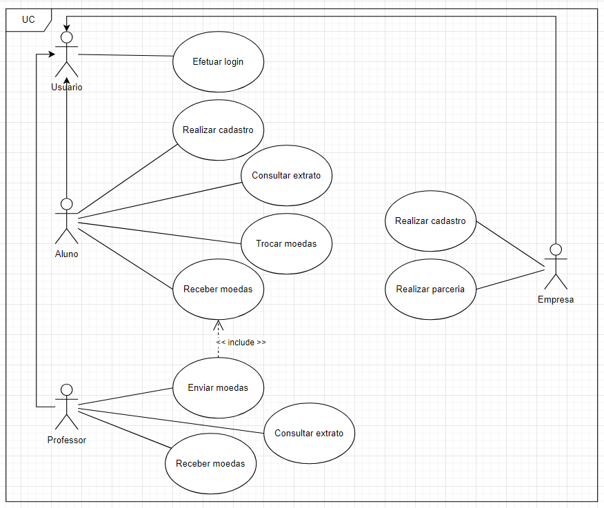
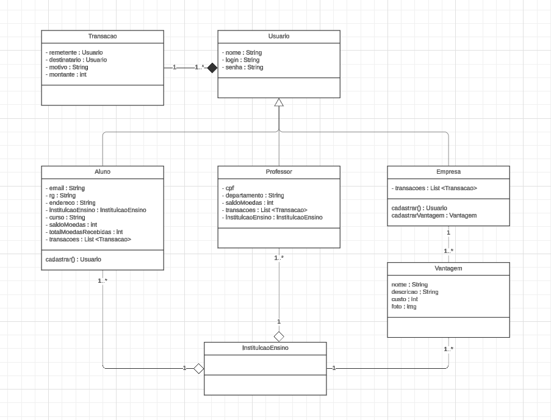
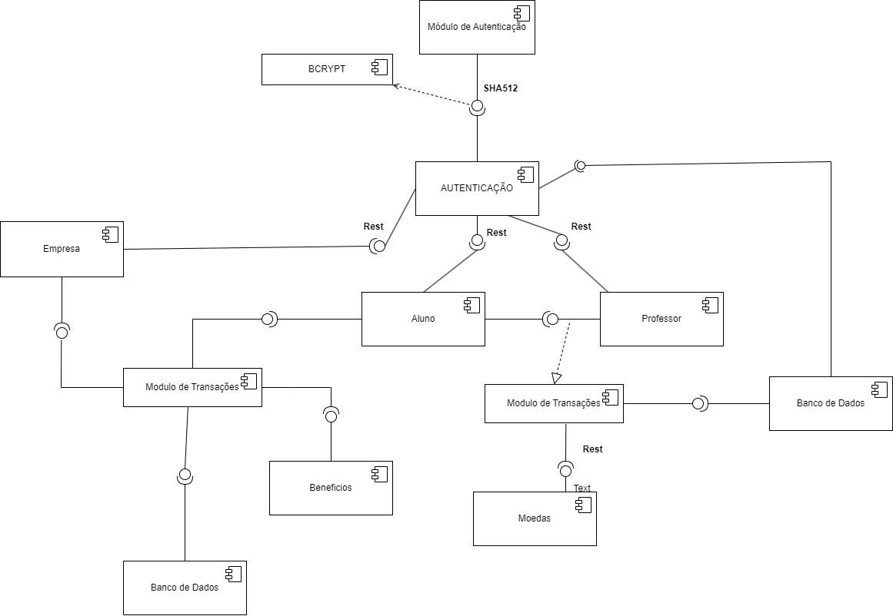

# LDS-Lab03

### Diagrama de Caso de Uso

### Diagrama de Classe

### Diagrama de Componente

### Histórias de Usuário
| História de Usuário | Como | Quero | Para |
|-------------------------|-----------------|-----------------------------------------|------------------------------------------------|
| Realizar Cadastro |	Aluno	| Poder se cadastrar no sistema	| Ter minhas informações no sistema |
|Efetuar Login |	Aluno/Professor/Empresa	| Poder efetuar login no sistema	| Acessar minhas informações e funcionalidades personalizadas |
|Consultar Extrato	| Aluno/Professor	| Consultar meu extrato de moedas	 | Visualizar meu saldo, histórico de transações e acompanhar meu progresso |
|Receber Moedas	| Aluno	| Receber moedas do meu professor |	Ser recompensado pelo meu desempenho e poder trocar por benefícios |
|Receber Moedas	| Professor	 | Receber meu saldo de moedas no início de cada semestre |	Poder recompensar meus alunos |
|Trocar Moedas	| Aluno	| Trocar minhas moedas por vantagens cadastradas	| Aproveitar os benefícios das empresas parceiras |
| Enviar Moedas	| Professor	| Enviar moedas para meus alunos	| Reconhecer seu mérito por bom comportamento e participação |
|Consultar Extrato	| Professor |	Visualizar meu extrato de moedas	| Acompanhar meu saldo, envios realizados e gerenciar a distribuição de moedas |
|Realizar Parceria	| Empresa |	Me cadastrar como parceira no sistema	| Oferecer vantagens aos alunos e atrair novos clientes |
